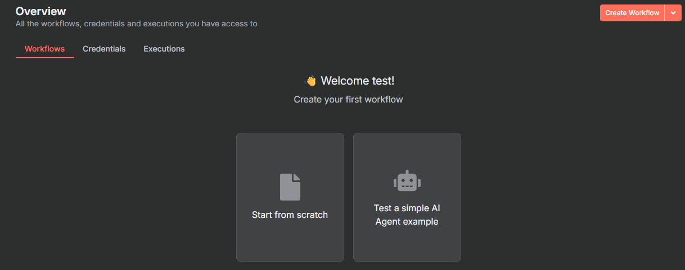

# 🚀 Getting Started with n8n + Ollama (AI Agent) on Windows

This guide walks you through installing **n8n** (workflow automation tool) and optionally **Ollama** (local AI language models) on your Windows machine. You'll also learn how to create your own **AI agent** using local models.

---

## ✅ Prerequisites

- A Windows computer
- If using Ollama: at least **8GB of video memory (VRAM)**
- 15–30 minutes of time

---

## 📦 Step 1 – Install Docker Desktop

1. Go to: [https://docs.docker.com/desktop/setup/install/windows-install](https://docs.docker.com/desktop/setup/install/windows-install)
2. Download and install Docker Desktop.
3. Restart your computer if needed.

---

## ▶️ Step 2 – Start Docker Desktop

- Launch **Docker Desktop** from the Start Menu.
- Wait until Docker is fully running (you should see a green indicator or message like “Docker is running”).

---

## 📂 Step 3 – Navigate to Your Project Directory

- Open the folder containing this guide, where also the docker-compose.yaml file is located.

---

## 🧩 Step 4 – Decide: Just n8n or n8n + Ollama?

- 👉 If you only want to run **n8n**, skip to **Step 6**.
- 👉 If you also want to run **Ollama** (to use AI models), continue to the next step.

---

## ✏️ Step 5 – Enable Ollama in `docker-compose.yml`

> ⚠️ Make sure your computer has **at least 8GB of VRAM** for Ollama.

1. Open the file `docker-compose.yml` using Notepad or a text editor.
2. Find the section where `ollama` is commented out (lines start with `#`).
3. Remove the `#` from those lines to **uncomment** them.
4. Save the file.

---

## 🧱 Step 6 – Start the Services

1. Open a Command Prompt or PowerShell in your project folder  
   (Tip: Hold **Shift + Right-Click** in the folder > "Open PowerShell window here")
2. Run the following command (this will start the n8n server and ollama):
```
docker compose up
```

3. Wait a few minutes for everything to start until you see:
```
n8n      | Editor is now accessible via:
n8n      | https://localhost:5678 
```
in your console output, you're ready to go.

---

## 🌐 Step 7 – Open n8n in Your Browser

Go to:  
👉 [http://127.0.0.1:5678/](http://127.0.0.1:5678/)

---

## 👤 Step 8 – Create an n8n Account (local only)

- Enter a username, password, and email (these can be made up).
- ⚠️ Save these login details – you'll need them next time.

---

## 📝 Step 9 – Fill Out the Initial Setup

- n8n will ask what you plan to use it for. Just write a short description (e.g. “automate emails” or “test project”).

---

## 🛠️ Step 10 – Start Your First Workflow

1. You’ll see the n8n dashboard.
2. Click **“Start from scratch”** to create your first automation.


