# 🧠 De Slimme Assistent die je Agenda Regelt (Zonder dat jij iets hoeft te doen)

Stel je voor: je stuurt een kort berichtje zoals “Plan een meeting met Peter-Jan morgen om 10 uur” — en *zonder dat je zelf iets hoeft te doen*, verschijnt die afspraak netjes in je Google Agenda.

In deze mini blog leggen we je uit hoe dit werkt in combinatie met het automatiseringsplatform n8n.

## 📊 De n8n workflow

> [!Note]
> Dit is een erg simpele implementatie van een AI agent, er is een scala aan mogelijkheden. Bedenk eerst goed wat je wilt gaan maken!

> [!Warning]
> Deze workflow is niet productie ready, er moet door mijn nog onderzoek gedaan worden of n8n goed in een productie environment uitgevoerd kan worden voor een stabiele implemenatatie van ai-agents kan je 'langchain' gebruiken.
---

## 🤖 Wat is een AI Agent?

Een **AI Agent** is een digitale assistent die taken uitvoert op basis van jouw instructies. Hij **begrijpt** wat je bedoelt, **onthoudt** wat je eerder hebt gezegd, en **doet iets** met die informatie.

[]

Een **AI-agent** is een autonoom softwaresysteem dat informatie verwerkt, beslissingen neemt en acties onderneemt om een specifiek doel te bereiken. In tegenstelling tot traditionele AI-chatbots, die voornamelijk reageren op gebruikersinvoer, zijn AI-agenten in staat om zelfstandig te opereren, gegevens te analyseren en complexe taken uit te voeren zonder menselijke tussenkomst.

---

### 🧠 Wat maakt een AI-agent uniek?

AI-agenten onderscheiden zich door hun vermogen om:

1. **Waarnemen**: Ze ontvangen input uit diverse bronnen, zoals gebruikersinteracties, API's, sensoren of opgeslagen kennisbanken.

2. **Verwerken**: Met behulp van technieken zoals natuurlijke taalverwerking (NLP) en machine learning begrijpen ze de context en inhoud van de ontvangen informatie.

3. **Beslissen**: Op basis van vooraf gedefinieerde doelen en regels nemen ze autonome beslissingen over de te ondernemen acties.

4. **Handelen**: Ze voeren acties uit, zoals het bijwerken van databases, communiceren met andere systemen of het sturen van meldingen naar gebruikers.

---

### 🔍 Verschil tussen AI-agenten en AI-chatbots

| Kenmerk             | AI-chatbot                                       | AI-agent                                                             
| ------------------- | ------------------------------------------------ | --------------------------------------------------------------------
| **Doel**            | Beantwoorden van vragen en voeren van gesprekken | Automatiseren van complexe processen en taken                       
| **Werkwijze**       | Reactief: reageert op gebruikersinvoer           | Proactief: neemt zelfstandig beslissingen en acties                
| **Functionaliteit** | Beperkt tot vooraf gedefinieerde scripts         | Flexibel: past zich aan op basis van context en leert van ervaringen 
| **Integratie**      | Vaak beperkt tot één platform of kanaal          | Kan meerdere systemen en platforms integreren                        

---

### 🛠️ Componenten van een AI-agent

Volgens Botpress bestaat een AI-agent uit de volgende kerncomponenten:

* **LLM Routing**: Het gebruik van grote taalmodellen (LLM's) om complexe taalverwerkingen uit te voeren.

* **Identiteit en Instructies**: Definieert de rol, doelen en gedragsregels van de agent.

* **Tools**: Hulpmiddelen en integraties die de agent gebruikt om gegevens te verzamelen en acties uit te voeren.

* **Geheugen en Kennis**: Opslag van informatie en ervaringen die de agent helpen bij toekomstige beslissingen.

* **Kanalen**: De platforms en interfaces waarmee de agent communiceert met gebruikers.

* **Governance**: Mechanismen die zorgen voor ethisch en verantwoord gedrag van de agent. 

---

## 🧠 Waar haalt de AI zijn intelligentie vandaan?

De "slimheid" komt van **LLM’s** — **Large Language Models** zoals ChatGPT. Deze modellen 'snappen' onze menselijke taal.

👉 **Ollama** is de interface die ervoor zorgt dat jouw AI Agent met deze taalmodellen kan werken.  
Denk aan Ollama als een tussenpersoon: ontvangt de bericht vanuit n8n (zelf kan n8n niet denken) en verstuurt het naar de LLM, de response van het LLM wordt hierna weer gebruikt binnen n8n om de juiste vervolgactie n.a.v. het resultaat uit het LLM uit te voeren.

---

## 🗣️ Het belang van de juiste **prompt**

Net zoals bij het comminuceren met collega's, is het belangrijk dat je **duidelijk en specifiek bent in wat je vraagt**.

Een goede **prompt** (de zin die je naar de AI stuurt) maakt het verschil tussen een slimme assistent en verwarring.

**Voorbeeld:**

- ❌ *Onhandige prompt*: “Zet iets in mijn agenda” 
- ✅ *Goede prompt*: “Plan een videovergadering met Pieter, morgen om 11 uur, 30 minuten lang”

> **Hoe specifieker je bent, hoe beter de AI snapt wat je bedoelt — en hoe kleiner de kans op fouten.**

---

## ⚙️ De workflow stap voor stap

1. 📩 Jij stuurt een chatbericht
2. 🤖 De **AI Agent** begrijpt je intentie via **Ollama**
3. 🧠 De agent gebruikt **geheugen** om eerdere context vast te houden
4. 📅 Hij bekijkt je Google Agenda
5. ✅ Als er ruimte is, plant hij het in

---

## 👁️ Volgende stap: **Human in the Loop**

De AI kan ook even **overleggen met jou**, voordat hij iets definitief doet.  
Bijvoorbeeld:

> “Er is een nieuwe afspraakverzoek voor morgen 14:00.  
> Heb je tijd, en wil je dit toevoegen?”

Je hoeft dan alleen nog maar te antwoorden met **ja** of **nee**.  
Zo blijft de controle bij jou, terwijl het meeste werk automatisch gebeurt.

---

## 📊 Workflow visueel 

```mermaid
graph TD
    A[💬 Chatbericht ontvangen] --> B[🤖 AI Agent start taak]
    B --> C[🧠 Begrijpt tekst via LLM]
    B --> D[🗂️ Geheugen onthoudt context]
    B --> E[📅 Checkt Google Calendar]
    B --> F{📝 Nieuwe afspraak maken?}
    F -->|✅ Ja| G[📆 Voegt afspraak toe]
    F -->|❓ Twijfel| H[🙋 Vraagt bevestiging aan gebruiker]
    H -->|👍 Ja| G
    H -->|👎 Nee| I[❌ Annuleert actie]
```

